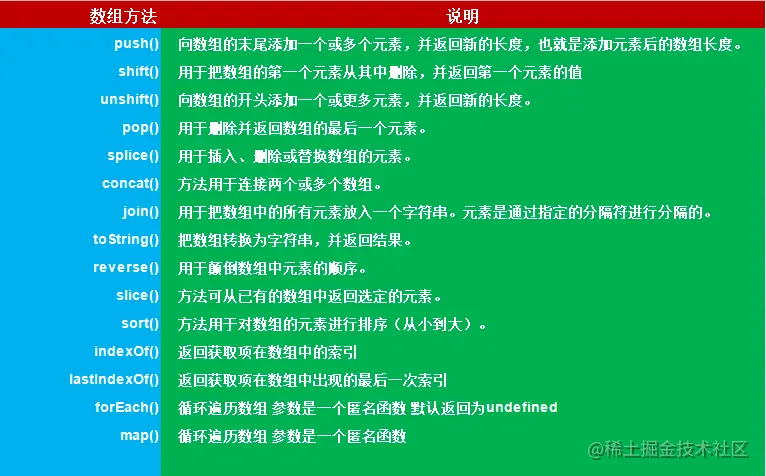
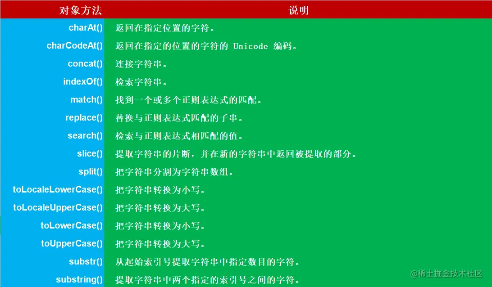
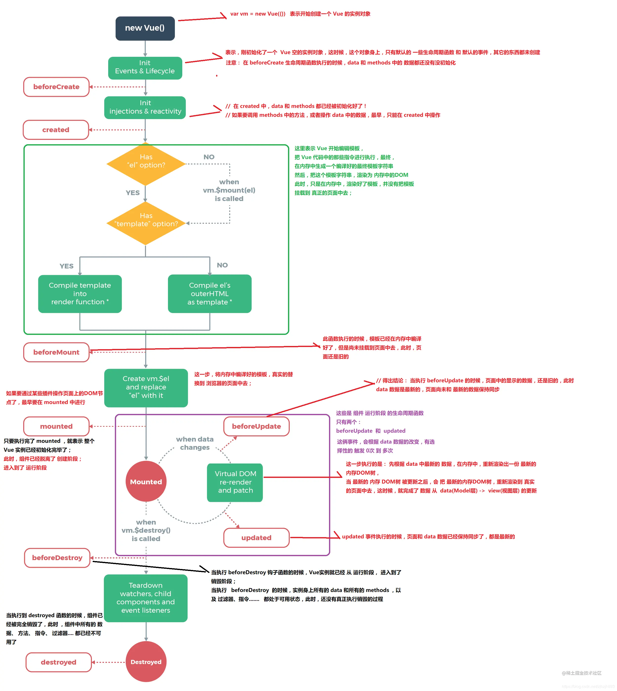

# 前端面试问题笔记

## 1. BFC
BFC 全称：`Block Formatting Context`,名为“块级格式化上下文”

W3C对其解释是：BFC决定了元素如何对其内容进行定位，以及与其他元素的关系和相互作用，当涉及到可视化布局时，BFC提供了一个环境，HTML在这个环境中按照一定的规则进行布局。

我的理解是，BFC是一个完全独立的空间（布局环境），让空间里的子元素不会影响到外面的布局

触发BFC：
- 浮动元素
- 绝对定位元素
- display:inline-Block
- display:table-cell
- display:table-caption
- overflow:hidden
- display:flex
- 


BFC的规则：
- BFC就是一个块级元素，块级元素会垂直方向一个接一个的排列
- BFC就是一个隔离的独立容器，容器里面的标签不会影响到外部标签
- 垂直方向的距离由margin决定，同一个BFC的两个相邻的标签外距会发生重叠
- 计算BFC的高度时，浮动元素也参与计算

BFC解决了什么问题：
1. 使用float脱离文档流，高度塌陷
2. Margin边距重叠
3. 两栏布局

## 16进制转10进制

### 16进制是字符串

eval是一个全局函数，会把传入的字符串当作JS代码执行。如果传入的参数不是字符串，会把结果原封不动的返回。
```javascript
eval('0xff').toString(16)
```

### 16进制是Number

```javascript
(0xff).valueOf()
```


### 10进制转16进制
```javascript
(255).toString(16)
```

## Ajax跨域


## position:relative, position:absolute,position.fixed区别

定位 | 是否脱离文档流 | 偏移
--- | --- | ---
relative | 否，原来的位置还占据空间 | 相对于当前位置
absolute | 是，原来的位置不占据空间 | 相对于最近的设置有position的祖先为基准进行偏移
fixed | 是，原来的位置不占据空间 | 相对于body（浏览器窗口）为基准进行偏移


## JSONP

JSONP:JSON with padding 的略称， 一种跨域解决方案

通过`<script></script>`标签发出的请求方式

跨域请求返回的相应数据会被浏览器丢弃

通过一些标签发出的请求不会被进行同源策略检查，如script标签，img标签

发请求前准备一个全局的接收函数

在script标签中发出请求

服务器端接收到请求，发回数据

浏览器接收到服务器响应

JSONP和ajax的异同：
相同点：都是客户端向服务器端请求数据，将数据那会客户端进行处理

不同点；
- ajax是一种官方推出的请求方式
- ajax异步请求，jsonp同步请求
- ajax同源检查，jsonp不存在同源检查
- ajax支持多种请求方式，JSONP只支持get请求
- ajax的使用更加简便


_ _proto_ _，读作“dunder proto”，“double underscore proto”的缩写）


## 数据类型

简单数据类型：
- Null
- Undefined
- Boolean
- String 
- Bumber
- Symbol
- Bigint

引用数据类型：
- Object

## 数据类型的转换

显式的转换：
- 转换为Boolean:Boolean()
- 转换为Number：Number()、parseInt()、parseFloat()
- 转换为String: .toString()、String()

一些操作符会有隐式转换的效果

## 数据类型判断

- typeof
- instanceof
- constructor
- Object.prototype.toString.call()


## js内置对象

主要指在程序执行之前就存在于全局作用域里面的由js定义的一些全局的值属性，函数属性，和一些用来实例化其他对象的构造函数对象。分类：
- 值属性：Infinity,NaN，undefined,Null
- 函数属性：可以直接调用，不要指定调用的对象，执行后会将结果返回给调用者：eval()、parseInt()
- 基本对象
- 数字和日期对象
- 字符串对象
- 可索引的集合对象
- 使用键的集合对象
- 矢量对象
- 结构化数据
- 抽象控制对象
- 反射
- 国际化
- 其他

## undefined和null的区别
undefined的意思是未定义

null代表的含义是空对象

null主要用于赋值给一些可能会返回对象的变量，作为初始化


## {}和[]的valueOf和toString的结果是什么？
```dotnetcli
{}的valueof是{}，toString的结果是[object Object]
[]的valueOf是[],toString的结果是""
```


TODO:创建对象的几种方式
## js创建对象的几种方式(未理解)

```dotnetcli
我们一般使用字面量的形式直接创建对象，但是这种创建方式对于创建大量相似对象的时候，会产生大量的重复代码。但 js
和一般的面向对象的语言不同，在 ES6 之前它没有类的概念。但是我们可以使用函数来进行模拟，从而产生出可复用的对象
创建方式，我了解到的方式有这么几种：

（1）第一种是工厂模式，工厂模式的主要工作原理是用函数来封装创建对象的细节，从而通过调用函数来达到复用的目的。但是它有一个很大的问题就是创建出来的对象无法和某个类型联系起来，它只是简单的封装了复用代码，而没有建立起对象和类型间的关系。

（2）第二种是构造函数模式。js 中每一个函数都可以作为构造函数，只要一个函数是通过 new 来调用的，那么我们就可以把它称为构造函数。执行构造函数首先会创建一个对象，然后将对象的原型指向构造函数的 prototype 属性，然后将执行上下文中的 this 指向这个对象，最后再执行整个函数，如果返回值不是对象，则返回新建的对象。因为 this 的值指向了新建的对象，因此我们可以使用 this 给对象赋值。构造函数模式相对于工厂模式的优点是，所创建的对象和构造函数建立起了联系，因此我们可以通过原型来识别对象的类型。但是构造函数存在一个缺点就是，造成了不必要的函数对象的创建，因为在 js 中函数也是一个对象，因此如果对象属性中如果包含函数的话，那么每次我们都会新建一个函数对象，浪费了不必要的内存空间，因为函数是所有的实例都可以通用的。

（3）第三种模式是原型模式，因为每一个函数都有一个 prototype 属性，这个属性是一个对象，它包含了通过构造函数创建的所有实例都能共享的属性和方法。因此我们可以使用原型对象来添加公用属性和方法，从而实现代码的复用。这种方式相对于构造函数模式来说，解决了函数对象的复用问题。但是这种模式也存在一些问题，一个是没有办法通过传入参数来初始化值，另一个是如果存在一个引用类型如 Array 这样的值，那么所有的实例将共享一个对象，一个实例对引用类型值的改变会影响所有的实例。

（4）第四种模式是组合使用构造函数模式和原型模式，这是创建自定义类型的最常见方式。因为构造函数模式和原型模式分开使用都存在一些问题，因此我们可以组合使用这两种模式，通过构造函数来初始化对象的属性，通过原型对象来实现函数方法的复用。这种方法很好的解决了两种模式单独使用时的缺点，但是有一点不足的就是，因为使用了两种不同的模式，所以对于代码的封装性不够好。

（5）第五种模式是动态原型模式，这一种模式将原型方法赋值的创建过程移动到了构造函数的内部，通过对属性是否存在的判断，可以实现仅在第一次调用函数时对原型对象赋值一次的效果。这一种方式很好地对上面的混合模式进行了封装。

（6）第六种模式是寄生构造函数模式，这一种模式和工厂模式的实现基本相同，我对这个模式的理解是，它主要是基于一个已有的类型，在实例化时对实例化的对象进行扩展。这样既不用修改原来的构造函数，也达到了扩展对象的目的。它的一个缺点和工厂模式一样，无法实现对象的识别。

嗯我目前了解到的就是这么几种方式。

```

## 继承的几种实现方式

```dotnetcli
我了解的 js 中实现继承的几种方式有：

（1）第一种是以原型链的方式来实现继承，但是这种实现方式存在的缺点是，在包含有引用类型的数据时，会被所有的实例对象所共享，容易造成修改的混乱。还有就是在创建子类型的时候不能向超类型传递参数。

（2）第二种方式是使用借用构造函数的方式，这种方式是通过在子类型的函数中调用超类型的构造函数来实现的，这一种方法解决了不能向超类型传递参数的缺点，但是它存在的一个问题就是无法实现函数方法的复用，并且超类型原型定义的方法子类型也没有办法访问到。

（3）第三种方式是组合继承，组合继承是将原型链和借用构造函数组合起来使用的一种方式。通过借用构造函数的方式来实现类型的属性的继承，通过将子类型的原型设置为超类型的实例来实现方法的继承。这种方式解决了上面的两种模式单独使用时的问题，但是由于我们是以超类型的实例来作为子类型的原型，所以调用了两次超类的构造函数，造成了子类型的原型中多了很多不必要的属性。

（4）第四种方式是原型式继承，原型式继承的主要思路就是基于已有的对象来创建新的对象，实现的原理是，向函数中传入一个对象，然后返回一个以这个对象为原型的对象。这种继承的思路主要不是为了实现创造一种新的类型，只是对某个对象实现一种简单继承，ES5 中定义的 Object.create() 方法就是原型式继承的实现。缺点与原型链方式相同。

（5）第五种方式是寄生式继承，寄生式继承的思路是创建一个用于封装继承过程的函数，通过传入一个对象，然后复制一个对象的副本，然后对象进行扩展，最后返回这个对象。这个扩展的过程就可以理解是一种继承。这种继承的优点就是对一个简单对象实现继承，如果这个对象不是我们的自定义类型时。缺点是没有办法实现函数的复用。

（6）第六种方式是寄生式组合继承，组合继承的缺点就是使用超类型的实例做为子类型的原型，导致添加了不必要的原型属性。寄生式组合继承的方式是使用超类型的原型的副本来作为子类型的原型，这样就避免了创建不必要的属性。
```

### 寄生式组合继承的实现


## 原型和原型链

引用类型的四个规则：
- 引用类型，都有对象特性，即可自由扩展属性
- 引用类型，都有一个隐式原型`__proto__`属性，属性值是一个普通的对象
- 引用类型，隐式原型`__proto__`的属性值指向它的构造函数的显式原型`prototype`属性值
- 当你试图得到一个对象的某个属性时，如果这个对象本身没有这个属性，那么它会去它的隐式原型`__proto__`（也就是它的构造函数的显示原型`prototype`中寻找


## this、call、apply、bind

1. 浏览器里，全局范围内this指向window对象
2. 在函数中，this指向最后调用它的那个对象
3. 在构造函数中，this指向new出来的那个新对象
4. all、apply、bind中的this被强制绑定在指定的那个对象上
5. 箭头函数中的this比较特殊，箭头函数this为父作用域的this，不是调用的this，箭头函数的this指向是静态的，声明的时候就确定下来的


### this
this设计的初衷是**在函数的内部使用，用来指代当前的运行环境**

#### global this 
全局范围内：
1. this等价与window对象
2. 用var 声明一个变量和给this或者window添加属性是等价的
3. 如果在声明变量时没有用var，就是再给全局的this添加或改变属性值

#### function this
函数中的this指向运行时最后调用它的那个对象

```dotnetcli
obj2.obj1.foo()
<!-- 最后调用foo()的是obj1,所以this指向obj1 -->
```
#### 构造函数中的this

所谓构造函数，就是通过这个函数生成一个新对象（object）当一个函数作为构造器使用时（通过new）它的this值绑定到新创建的那个对象。如果没有使用new关键字，那么它就是一个普通对象，this将指向window对象

谁被new了，this就指向谁

#### class中的this

类通常包含一个constructor，this可以指向任何新创建的对象。不过在作为方法时，如果该方法作为普通函数被调用，this也可以指向任何其他值。与方法一样，类也可能失去对接受器的跟踪。

构造函数里的this指向新创建的类实例

#### call、apply、bind中的this


call、apply、bind中的this的强绑定，用来改变函数执行的this指向


#### 箭头函数中的this

es6的箭头函数中没有this绑定，必须通过查找作用域链来决定其值，如果箭头函数被非箭头函数包含，则this绑定的是最近一层的非箭头函数的this，否则，this为undefined。箭头函数的this始终指向函数定义时的this，而非执行时。


### call&apply
每个函数都包含两个非继承而来的方法：`apply()`和`call()`。这连个方法的用途都是在特定的作用域中调用函数，实际上等于设置函数体内this对象的值


#### apply()

apply()方法接收两个参数：一个是在其中运行的函数作用域，另一个是参数数组。其中，第二个参数可以使Array的实例，也可以是auguments对象

#### call()

call()和apply()唯一区别是接收参数的方式不同。在使用call()时2，传递的参数必须逐个列举出来

- 参数数量、顺序确定就用call，不确定就用apply
- 考虑可读性：参数数量不多用call，多用apply

### bind()

bind()方法会创建一个函数的实例，这个函数的实例的this会被绑定到传给bind(a)的a身上，然后将这个函数创建的函数实例返回

bind()会返回一个新的函数

```javascript
window.color = "red"; 
var o = { color: "blue" }; 
function sayColor(){ 
 alert(this.color); 
} 
var objectSayColor = sayColor.bind(o); 
objectSayColor(); //blue
```

#### call/apply与bind的区别

- 执行方式不同
  - call、apply改变了函数的this上下文后马上执行该函数
  - bind则是返回改变了上下文后的函数，不立即执行该函数
- 返回值不同
  - call、apply返回的是函数的执行结果
  - bind返回的是一个新创建的函数，这个新创建的函数是在拷贝原先函数的基础上，改变了其this的指向，保存了函数的参数

### 手写实现apply、call、bind

#### apply 


#### call/apply/bind的核心理念

核心理念是向其他对象借用方法


## 构造函数和普通函数的区别
- 在构造函数执行，初始化作用域链之前，浏览器会默认先创建一个对象（空对象）
- 初始化this，这里的初始化this，会将this指向第三步创建的对象，所以在后期代码执行this.xx=xx的时候，实际上就是在往这个对象（实例对象）上添加属性或者方法
- 函数执行完，出栈之前，会查看函数本身返回的结果：
  - 如果有return对象，则以返回值为主，
  - 如果没有返回值或者返回的是一个原始值，则浏览器默认会将创建的实例返回


## js获取原型的方法


- p.proto
- p.constructor.prototype
- Object.getPrototypeOf(p)


## 什么是闭包，为什么要用它？

闭包是指有权访问另一个函数作用域内变量的函数

闭包有两个常用的用途：

- 使我们在函数外部能够访问到函数内部的变量。通过使用闭包，我们可以在外部调用闭包函数，从而在外部访问到函数内部的变量，可以使用这种方法来创建私有变量
- 函数的另一个用途是使已经运行结束的函数上下文中的变量继续保存在内容中，因为闭包函数保留了这个变量对象的引用所以这个变量对象那个不会被回收

闭包的本质就是作用域链的一个特殊应用


一个函数可以访问在它的调用上下文中定义的变量，这个就是词法作用域

函数定义可以存储在变量中，函数定义在程序调用之前是不可见的，每次调用函数，都会临时创建一个本地执行上下文。当函数执行完成时，执行上下文消失。


无论何时声明新函数并将其赋值给变量，都要存储函数定义和闭包。闭包包含在函数创建时作用域中的所有变量，类似于背包。函数定义附带一个小背包，它的包中存储了函数定义创建时作用域中的所有变量


闭包的方法是通过背包的类比，当一个函数被创建并传递或从另一个函数返回时，他会携带一个背包。背包中是函数声明时作用域内的所有变量


更宏观的理解：
```dotnetcli
闭包本质上是上级作用域内变量，因为被下级作用域内引用，而没有被释放，生命周期未结束。这就导致上级作用域内的变量等到下级作用域执行完后才会正常得到释放，结束它的生命周期。
```


### 执行上下文

每当运行代码的时候，代码就会生成执行上下文，执行环境

执行环境：
- 全局环境
- 函数环境
- Eval环境


## 两种路由的模式


## DOM 和BOM


BOM是指文档对象模型，指的是把文档当做一个对象来看待，这个对象主要定义了处理网页内容的方法和接口

BOM是指浏览器对象模型，指的是把浏览器当做一个对象来看待，这个对象主要定义了与浏览器进行交互的方法和接口。
BOM的核心是window，而window对象具有双重角色，既是通过js访问浏览器窗口的一个接口，又是一个global对象。这意味着网页中定义的任何对象，变量，函数等，都是作为global对象那个的一个属性和方法存在。DOM最根本的对象document也是BOM的window对象的一个子对象


## 三种事件模型
- DOM0级模型
- IE事件模型
- DOM2级时间模型

## 事件委托
事件委托本质上是利用了浏览器事件冒泡的机制。因为事件在冒泡过程中会上传到父节点，并且父节点可以通过时间对象获取到目标节点，因此可以把子节点的监听函数放在父节点上，由父节点统一处理多个子节点的事件，这种方式称为事件代理

使用事件代理可以不必要为每一个子元素都绑定一个监听事件，这样减少了内存上的消耗。并且使用事件代理我们还可以实现事件的动态绑定。比如新增了一个子节点，不需要为他单独绑定监听事件

## 什么是事件传播

当事件发生在DOM元素上是，该事件并不完全发生在那个元素上

事件传播有三个阶段
1. 捕获阶段：事件从window开始，然后向下传递到每个元素，直到达到目标元素事件或者event.target
2. 目标阶段：事件已达到目标元素
3. 冒泡阶段：事件从目标元素冒泡，然后上升到每个元素，知道到达window

## DOM操作

### 创建新节点
```javascript
createDocumentFragment()  //创建一个DOM片段
createElement() //创建一个具体的元素
createTextNode() //创建一个文本节点
```


### 添加、移除、替换、插入
```javascript
appendChild()
removeChild()
replaceChild(new,old)
insertBefore(new,old)
```

### 查找
```javascript
getElementById()
getElementByName()
getElementByTagName()
getElementByClassName()
querySelector()
querySelectorAll()
```

### 属性操作

```javascript
getAttribute()
setAttribute()
hasAttribute()
removeAttribute()
```


## 数组合字符串的原生方法






## 正则表达式

## js延迟加载的方式有哪些


js的加载解析和执行会阻塞页面的渲染过程，因此我们希望js脚本能够延迟加载，提高页面的渲染速度


几种方式：
- 将js脚本放在文档的最底部
- 给js脚本添加defer属性，这个属性会让脚本的加载与文档的解析同步解析，然后在文档加载完成后再执行这个脚本
- 给js脚本添加async属性，这个属性会使脚本异步加载，不会阻塞页面的解析过程，但是当脚本加载完成后会理解执行js脚本，如果这时候文档还没有解析完成同样会阻塞
- 动态创建DOM标签的方式，我们可以对文档的加载事件进行监听，当文档加载完成后再动态的创建script标签来引入js脚本

## 模块化

 什么是模块？
- 讲一个复杂的程序依据一定的规则封装成几个块，并进行组合在一起
- 块的内部数据与实现是私有的，只是向外部暴露一些接口（方法）与其他模块通信

一个模块时实现一个特定功能的一组方法，在最开始的时候，js只实现一些煎蛋的功能，并没有模块的概念，但随着程序越来越复杂，代码的模块化开发变得越来越重要

由于函数具有独立作用域的特点，最原始的写法是使用函数来作为模块，几个函数作为一个模块，但是这种方式容易造成全局的变量污染，并且模块间没有关系。

后面提出了对象写法，通过将函数作为一个对象的方法来实现，这样解决了直接使用函数作为模块的一些缺点，但是这种方法会暴露所有的模块成员，外部代码可以直接修改内部属性的值

现在最常用的是立即执行函数的写法，通过利用闭包来实现模块私有作用域的建立，同时不会对全局作用域造成污染

## 模块规范

- CommonJs:通过require来引入模块，通过module.exports来定义模块的输出接口，这种模块加载方案是服务器端的解决方案，以同步的方式来引入模块，因为在服务器端文件都是存储在本地的磁盘，所以读取速度非常快。但在浏览器端，由于模块的加载时通过网络请求，因此使用异步加载的方式更加合适
- 第二种是AMD方案，这种方案采用异步加载的方式来加载模块，模块的加载不影响后面语句的执行，所有依赖这个模块的语句都定义在一个回调函数里，等到加载完成后再执行回调函数。`require.js`实现了AMD的规范
- 第三种是CMD 方案，这种和AMD方案都是为了解决异步模块加载的问题.`sea.js`实现了CMD 规范。它和`require.js`的区别在于模块定义时对依赖的处理不同和对依赖模块的执行的时机的处理不同
- ES6：使用import和export的形式来导入导出模块


## AMD和CMD规范的区别
- 第一个方面是在模块定义时对依赖的处理不同。AMD推崇依赖前置，在定义模块的时候就要声明其依赖的模块。而CMD推崇就近依赖，只有在用到某个模块的时候采取require
- 第二个方面是对依赖模块的执行时机处理不同。首先AMD和CMD对于模块的加载都是异步的，不过他们的区别在于模块的执行时机。AMD在依赖模块模块加载完成后就直接执行依赖模块，依赖模块的执行顺序和我们的书写顺序不一定一致。而CMD在依赖模块加载完成后并不执行，只是下载，等到所有的模块都加载好后，进入回调函数的逻辑，遇到require语句才会执行对应的模块，这样的模块执行顺序和我们书写的顺序就一致了

## require.js的核心原理是什么

reuqire.js的核心原理是通过动态创建script脚本来异步引入模块，然后对每个脚本的load事件进行监听，如果每个脚本都加载完成了，再调用回调函数

## 事件循环

1. 首先js是单线运行的，在代码执行的时候，通过将不同的函数的执行上下文来压入栈中来保证代码的有序执行
2. 在执行同步代码的时候，如果遇到了一步事件，js引擎不会一直等待其返回结果，而是会将这个事件挂起，继续执行执行栈中的其他任务
3. 当同步事件执行完毕后，再将一步事件对应的回调加入到当前执行栈中不同的另一个任务队列中等待执行
4. 任务队列可以分为宏任务和微任务队列，当当前执行栈中的事件执行完毕后，js引擎首先会判断微任务队列中是否有任务可以执行，如果有就将微任务队列队首的事件压入栈中执行
5. 当微任务队列中的任务都执行完毕后再去判断宏任务队列中的任务


## auguments的对象是什么？

auguments对象是函数中传递的参数值的集合。是一个类似数据的对象，因为他有一个length属性，我们可以使用数据索引表示法arguments来访问单个值，但他没有数组中的内置方法


可以使用Array.prototype.slice.call(arguments)

箭头函数中没有arguments对象

## V8 引擎的垃圾回收机制


https://juejin.cn/post/6981588276356317214

## 哪些操作会造成内存泄露

- 使用未声明的变量，意外的全局变量
- 被遗忘的计时器或者回调函数
- 脱离DOM的引用
- 闭包包含在函数创建时作用域中的所有变量
  


## ECMAScript是什么？

ECMAScript是编写脚本语言的标准


javascript=ECMAScript+DOM+BOM


## ES6的新特性
- 块作用域
- 类
- 箭头函数
- 模板字符串
- 加强的对象字面量
- 对象解构
- Promise
- 模块
- Symbol
- 代理（proxy）Set 
- 函数默认参数
- rest和展开


更新内容分为以下几块：
- 表达式：声明、解构赋值
- 内置对象：字符串扩展、数值扩展、对象扩展、数组扩展、函数扩展、正则扩展、Symbol、Set、Map、Proxy、Reflect、
- 语句与运算：Class、Module、lterator
- 异步编程：Promise、Generator、Async


## let var const 区别


var声明的变量会挂载在window上，let和const声明的变量不会


var声明变量存在变量提升，let和const不存在变量提升

let const 声明形成块作用域

同一作用域下let和const不能声明同名变量，var可以

暂存死区


### 变量提升

包括：
- 变量声明提前
- 函数声明提前

函数声明提前的优先级更高


ES6之前，声明变量都是使用`var`使用var声明的变量都是函数作用域，即在函数体内可见，这会带来一个问题就是声明提前。变量在赋值之前可以访问到这个量，值是`undefined`


## 什么是箭头函数？

箭头函数表达式的语法比函数表达式更简介，并且没有自己的`this.arguments`,`super`或者`new.target`。箭头函数表达式更适用哪些本来需要匿名函数的地方，并且不能用作构造函数


不需要return关键字

如果箭头函数只有一个函数，则可以声明括号

箭头函数不能访问arguments对象

箭头函数没有自己的this。它捕获词法作用域函数的this值。


<!-- TODO:了解class -->
## 什么是类

类是ES6编写构造函数的新方法，是使用构造函数的语法糖，在底层中任然是原型和基于原型的继承

## 什么是模板字符串

模板字符串是js中创建字符串的一种新方法，我们可以通过使用反引号来时模板字符串化

在ES5中我们需要用到一些转义字符来达多行的效果，在模板字符串不需要这么麻烦


## 什么是对象解构

是从对象或者数组中提取值的一种新的，更简洁的方法

从对象获取属性，早期方式是创建一个与对象属性同名的变量
```dotnetcli
var firstName=employee.firstName
```

使用解构方式语法变得简洁：
```dotnetcli
{firstName,lastName}=employee
```

可以为属性取别名，当属性值为Undefined时，可以指定默认值


## 什么是Set对象

Set对象允许你存储任何类型的唯一值，无论是原始值或者是对象引用

可以使用Set()构造函数创建Set实例

用add()方法添加新值，返回一个新的set对象

使用has方法检查是否存在特定的值

size方法获取Set实例的长度

clear方法删除set的数据

可以使用set对象来删除数组中的重复元素

`WeakSet`与set类似，也是不重复的值的集合。但是`WeakSet`只能是对象。`WeakSet`对象都是弱引用，即垃圾回收机制不考虑`WeakSet`对该对象的引用


## proxy

Proxy用于修改某些操作的默认行为，等同于在语言层面作出修改，属于一种元编程
Proxy可以理解成在目标对象之前架设一层拦截，外界对该对象的访问，都必须通过这层拦截，因此提供了一种机制，可以对外接的访问进行过滤和改写。

## 通用的事件侦听器函数

```javascript
const EventUtils = {
  // 视能力分别使用dom0||dom2||IE方式 来绑定事件
  // 添加事件
  addEvent: function(element, type, handler) {
    if (element.addEventListener) {
      element.addEventListener(type, handler, false);
    } else if (element.attachEvent) {
      element.attachEvent("on" + type, handler);
    } else {
      element["on" + type] = handler;
    }
  },

  // 移除事件
  removeEvent: function(element, type, handler) {
    if (element.removeEventListener) {
      element.removeEventListener(type, handler, false);
    } else if (element.detachEvent) {
      element.detachEvent("on" + type, handler);
    } else {
      element["on" + type] = null;
    }
  },

  // 获取事件目标
  getTarget: function(event) {
    return event.target || event.srcElement;
  },

  // 获取 event 对象的引用，取到事件的所有信息，确保随时能使用 event
  getEvent: function(event) {
    return event || window.event;
  },

  // 阻止事件（主要是事件冒泡，因为 IE 不支持事件捕获）
  stopPropagation: function(event) {
    if (event.stopPropagation) {
      event.stopPropagation();
    } else {
      event.cancelBubble = true;
    }
  },

  // 取消事件的默认行为
  preventDefault: function(event) {
    if (event.preventDefault) {
      event.preventDefault();
    } else {
      event.returnValue = false;
    }
  }
};
```


## 函数式编程

是一种编程范式，是通过编写纯函数，避免共享状态、可变数据、副作用来构建软件的过程

## 高阶函数

将函数作为参数或者返回值的函数


## 函数被称为一等公民

在js中，函数不仅拥有一切传统函数的使用方式（声明和调用），而且可以做到像简单值一样：
- 赋值
- 传参 
- 返回  

不仅如此，js的函数还充当了类的构造函数的作用，同时又是Function类的实例。这样的多重身份让js的函数变得非常重要

## 手动实现`Array.prototype.map`方法

## 手动实现`Array.prototype.filter`方法

## 手动实现`Array.prototype.reduce`方法


## js的深浅拷贝

- 浅拷贝：创建一个新对象，这个对象有着原始对象属性值的一份精确拷贝，如果属性是基本类型，拷贝就是基本类型的值，如果属性是引用类型，拷贝的是内存地址
- 深拷贝：将一个对象从内存中完整的拷贝一份出来，在堆内存中开辟一个新的区域存放新对象，且修改新对象不会影响源对象

浅拷贝实现：
- Object.sssign()方法：将所有可枚举属性的值从一个或者多个源对象复制到目标对象，返回目标对象
- Array.prototype.slice()
- 扩展运算符： `...`


### 深拷贝实现：

乞丐版：

JSON.parse(JSON.strngify(object))


缺点：
- 会忽略undefined,symbol,函数；
- 不能解决循环引用
- 不能处理正则，new Date()


基础版：
```javascript
function cloneDeep(target,map=new WeakMap()){
    if (typeOf target=== 'object'){
        let cloneTarget=Array.isArray(target)?[]:{}


        if (map.get(target)){
            return target;
        }

        map.set(target,cloneTarget);

        for (const key in target){
            cloneTarget[key]=cloneDeep(target[key],map)
        }

        return cloneTarget
    }else {
        return target
    }
}
```


## 函数柯里化


> 函数柯力化指的是将使用多个参数的一个函数转换为使用一个参数的多个函数的技术


```javascript
// es6实现方式：

function curry(fn,...args){
    return fn.length<=args.length? fn(...args) : curry.bind(null,fun,...args)
}
```


## 模拟new操作符的实现


new 运算符创建一个用户定义的对象类型的实例或具有构造函数的内置对象的实例。new关键词会进行如下的操作：
1. 创建一个空的简单js对象
2. 链接该对象到另一对象（即设置该对象的构造函数）
3. 将步骤1创建的对象作为this的上下文
4. 如果该函数没有返回对象，就返回this

实现：
```javascript
function objectFactory(){
    var obj = {}

    var Constructor=[].shift.apply(arguments)

    // 将新对象的内部属性__proto__指向构造函数的原理，这样新对象就可以访问原型中的属性和方法

    obj.__proto__=Constructor.prototype

    // 取得构造函数的返回值
    var ret=Constructor.apply(obj,arguments);

    // 如果返回的是一个对象，就返回该对象，否则返回构造函数的实例对象
    return typeoff ret === 'object' ? ret :obj
}
```

## 回调函数

> 回调函数是一段可执行的代码段，作为参数传递给其他代码的，其作用是在需要的时候方便调用这段（回调函数）代码


js中函数也是对象的一种同样对象那个可以作为参数传递给函数，因此函数可以作为参数传递给另一个函数，这个作为参数的函数就是回调函数


回调函数的缺点：
- 容易写出回调地狱（回调地狱就是异步回调函数的嵌套）
- 不能用try catch捕获错误
- 不能直接return 


## Promise 


Promise直译过来就是承诺，它承诺过段时间会返回给你一个结果。Promise是ES6中异步编程的一种解决方案

> Promise 对象是一个代理对象，被代理的值在Promise创建时可能是未知的，它允许你为异步操作的成功和失败分别绑定处理方法。


一个Promise有以下几种状态：
- pending：初始状态
- fulfilled:意味着操作成功完成
- rejected:意味着操作失败


手写实现：
```javascript
function myPromise(constructor){
    let self=this;

    self.status='pending'
    self.value=undefined
    self.reason=undefined
    function resolve(value){
        if(self.status==='pending'){
            self.value=value;
            self.status='resolveDynamicComponent'
        }
    }

    function reject(reason){
        if(self.status==='pending'){
            self.reason=reason;
            self.status='rejected'
        }
    }


    try{
        constructor(resolve,reject);
    }catch(e){
        reject(e)
    }
}


// 定义链式调用的then方法
myPromise.prototype.then=function(onFulllilled,onRejected){
    let self=this;
    switch(self.status){
        case "resolved":
            onFulllilled(self.value);
            break;
        case "rejected":
            onRejected(self.reason);
            break;
        default;
    }
}
```
## Iterator Generator
<!-- TODO: -->
## async/await

`async/await`是建立在Promise之上的编写异步或者非阻塞代码的新方法，被普遍认为是js异步操作最终解决方案


如果函数加上async，那么该函数就会返回Promise对象


优缺点：
- 优点：优势在于处理then的调用链，更清晰
- 缺点:await把异步代码改为了同步代码，如果多个异步代码没有依赖性却使用了await会导致性能上的降低

## instanceof的原理是什么

instanceof能正确的判断对象的类型，是因为内部机制是通过判断对象的原型链中是不是能找到类型的prototype

## 节流防抖

- 防抖：指在事件被触发n秒之后再执行回调，如果在n秒之内事件又被触发，则重新计时
- 节流：单位时间内智能有一次触发事件的回调函数执行，如果在同一个时间单位内某事件被重复触发，则只有一次生效

手写实现：
```javascript
// 防抖
function debounce(fn,wait){
  var timer=null;

  return function(){
    var context=this,
    var args=arguments
    if(timer){
      clearTimeout(timer);

      timer=null;
    }

    timer=setTimeout(() => {
      fn.apply(context,args)
    },wait);
  }
}


// 节流 
function throttle(fn,delay){
  var preTime=Date.now()

  return function(){
    var context=this
    args=arguments,
    nowTime=Date.now()

    if(nowTime-preTime>=delay){
      preTime=Date.now()
      return fn.apply(context,args)
    }
  }
  
}
```


## 遍历对象的几种方式

#### for...in
`for...in`可以遍历对象的所有可枚举属性包括对象本身的和对象继承过来的属性

```javascript
let obj={
  name:'xiaowang',
  age:18
}

for(item in obj){
  console.log(item);
}
```


#### Object.keys()


Object.keys()可以遍历所有的可枚举属性，返回一个数组

```javascript
let obj={
  name:'xiaowang',
  age:18
}

Object.keys(obj)
```


#### Object.values
大致与Object.keys()相同，但返回的是属性值

#### Object.entris()

Object.entris()的返回值为Object.keys()和Object.values()的组合，也就是说它返回一个嵌套数组，数组包含属性名和属性值

#### Object.getOwnPropertyNames()


与Object.keys()差不多，但是不可枚举的属性也会返回

#### Reflect.ownKeys()

返回一个数组，不仅包含所有的属性名，还会把所有的属性返回，比如length


#### 受控组件和不受控组件


受控组件：某个组件状态的掌控，值由用户设置，而不能通过代码控制


> 在HTML的表单元素中，它们通常自己维护一套state，并随着用户的输入自己进行UI上的更新，这种行为是不被我们程序所管控的。而如果将React里的state属性和表单元素的值建立依赖关系，再通过onChange事件与setState()结合更新state属性，就能达到控制用户输入过程中表单发生的操作。被React以这种方式控制取值的表单输入元素就叫做受控组件。


## vue-router

- hash
- history

## vue 中的key

key是给每一个node的唯一ID，也是diff的一种优化策略，可以根据key，更准确，更快的找到哦啊对应的node节点

- key的作用是为了更高效的更新虚拟DOM，其原理是vue在整个patch过程中通过可以可以更准确的判断两个节点是不是同一个，从而避免频繁更新不同元素，使patch过程更加高效，减少DOM操作量，提高性能
- vue在使用相同标签名元素的过度切换时，也会使用到key属性，其目的是为了让vue可以区分他们

#### 为什么不用index做key


影响性能，当用index作为key的时候，删除一个节点，这时候这个节点后面所有的节点的index都改变了，用index做为值的key值也相应的都改变了，这时候这个节点的后面所有节点都会导致重新渲染。


## webpack 打包 js为什么要加hash值


静态资源首次被加载后浏览器会进行缓存，同一个资源在缓存未过期的情况下一般不会再去请求，那么当资源有更新的时候如何通知浏览器资源有变化呢？资源文件命名hash化就是为解决这个问题而生的

webpack分为
- hash
- chunkhash
- contenthash

## webpack 的loader

webpack 是基于node的，本身只能处理js和JSON的文件，loader是用来处理其他类型的文件，比如：
- 将less转为css
- 将jsx转为js
- 将ES5转为ES5等

## webpack打包体积分析

webpack 的工具`webpack-boundle-analyzer`可以可视化的发展每个module占用的体积

速度分析：`speed-measure-webpack-plugin`


## 提升webpack的性能

- 使用高版本的webpack和node.js
- 多进程解析
  - thread-loader
- 多进程，并行压缩
  - 使用parallel-uglify-plugin插件
- 进一步分包，预编译资源模块
- 充分利用缓存提升二次构建速度
  - babel-loader开启缓存
- 减少构建目标
  - 比如babel-loader不解析node_modules
- 进行图片压缩
  - image-webpack-loader压缩图片
- 动态polyfill


# Vue

## 在生命周期内调用异步请求
可以在钩子函数created、beforeMount、mounted中调用，因为这三个钩子中的data已经构建，可以将服务端返回的数据进行赋值。


## 什么阶段可以访问DOM

在钩子函数mounted被调用前，vue已经将编译好的模板挂载到页面上，在mounted中可以访问DOM。




## 父组件监听子组件的生命周期


#### 方法一：使用`$emit`


```javascript
//  Parent.vue

<child @created="dosomething"></child>


// child.vue
created(){
  this.$emit('created')
}

```


#### 方法二：使用`@hook`

```javascript
// parent.vue

<child @hook:created></child>
```


## keep-alive
keeep-alive 是vue内置的一个组件，可以使被包含的组件保留状态，避免重复渲染，有以下特性：
- 一般结合路由和动态组件一起使用，用于缓存组件
- 提供include属性和exculde属性，include属性表示匹配的组件会被缓存，exclude表示任何匹配的不会被缓存
- 对应两个钩子函数，activated和deactivated，当组件被激活时，触发钩子函数activated,当组件被移除时，触发deactivated


## 组件中的data为什么是一个函数


因为Vue组件是用来复用的，而js里的对象是一个引用关系，如果data是一个对象，那么各个复用的子组件之间的作用域是没有隔离的，子组件中的data属性值会相互影响。而如果data是一个函数的话，每个实例可以维护一份被返回对象的独立的拷贝，组件的实例之间的data不会相互影响。

new Vue的实例是不会被复用的，因此不存在引用对象的问题


## v-model的原理


v-model主要使用在表单input、textarea、select等元素上创建双向数据绑定。我们知道v-model其实是一个语法糖，v-model在内部为不同的输入元素使用不同的属性，并抛出不同的事件,比如：
- text和textarea元素使用value属性和input事件
- checkbox和radio使用checked属性和chenge事件
- select字段将value作为prop并将change作为事件


input表单元素为例：
```javascript
<input v-model="something">


// 相当于：
<input v-bind:value="something" v-on:input="something=$event.target.value"
```


自定义组件中，v-model默认会利用名为value的prop和名为input的事件

## Vue组件通信

组件通信主要分为三类：父子组件通信，隔代组件通信和兄弟组件通信


主要通信方式可分为：
- `props/$emit`适用于父子组件通信
- `ref`与`$parent/$children` 适用于父子组件通信
- `$emit/$on`适用于父子，隔代，兄弟组件通信
- `$attrs/$listeners`适用于隔代组件通信
- `provide/inject`适用于隔代组件通信
- Vuex适用于父子、隔代、兄弟组件通信


## Vuex

Vuex是一个专门为Vue.js应用程序开发的状态管理模式，每一个Vuex的应用核心是一个store，store是一个容器，包含着应用中的大部分状态

vuex的存储状态是响应式的，当vue组件从store中读取状态的时候，如果store中的状态发生变化，组件也会相应的更新

改变store状态的唯一途径就是显式地提交（commit)mutation

包括以下几个模块：
- State：定义了应用状态的数据结构，我们可以在这里设置默认状态
- Getter：允许组件从Store中获取数据，mapGetters辅助函数仅仅是将store中的getter映射到局部的计算属性
- Mutation：是唯一的更改store状态的方法
- Action：用于提交mutation，而不是直接变更状态，可以包含任意异步操作
- Module：允许将单一的store拆分为多个store

## vue-router的路由模式有几种

三种路由模式：
- hash：使用URL hash作为路由，支持所有的浏览器
- history:依赖HTML5 History API和服务器的配置。
- abstory:支持所有的js运行环境，如果没有浏览器的API，路由会自动强制进入这个模式

#### 实现的原理

##### hash模式的实现原理

基于location.hash来实现的，location.hash的值就是URL中`#` 后面的内容


hash路由模式的实现主要基于以下几个特性：
- URL中hash值只是客户端的一种状态，当向服务器发出请求时，hash部分不会被发送
- hash值的改变，都会在浏览器的访问历史中增加一个记录，因此我们可以通过浏览器的回退、前进按钮控制hash的变换
- 可以使用a标签并设置href值，当用户点击这个标签时，hash值会发生改变；或者使用js来对location.hash进行赋值
- 可以使用hashchange事件来监听hash的变化，从而对页面进行跳转

##### history实现原理


HTML5 提供了HIstory API来实现URL的变化。最主要的API有两个：
- history.pushState()
- history.replaceState()

这两个API可以在不刷新的情况下，操作浏览器的历史记录。


## vue是如何实现数据双向绑定的

数据双线绑定指：数据变化更新视图，视图变化更新数据

即：
- 当输入框的内容变化时，Data中的数据同步发生变化
- 当data中的数据发生变化时，文本节点的内容同步变化

因为view变化更新data可以通过设置事件监听的方式来实现，所以Vue的数据双向绑定的工作主要是根据Data变化来更新view

通过以下四个步骤来实现双向数据绑定：
1. 实现一个监听器Observer：对数据对象进行遍历，包括子属性对象的属性，，利用Object.defineProperty()对属性都加上getter和setter。这样的话，度这个对象的某个值赋值，就会触发setter，就能监听到数据变化
2. 实现一个解析器Compile：解析Vue模板指令，将模板中的变量都替换成数据，然后初始化渲染页面视图，并且将每个指令对应的节点绑定更新函数，添加监听数据的订阅者，一旦数据有变动，收到通知，调用更新函数进行数据更新
3. 实现一个订阅者Watcher：Watcher是Observer和Compile之间的通信桥梁，主要的任务是订阅Observer中的属性值变化的消息，当属性值变化时，触发解析器的对应的更新函数
4. 实现一个订阅器Dep:订阅器采用发布订阅模式，用来采集Watcher，对监听器和订阅器进行统一管理


## Vue如何实现对对象和数组的监听

vue通过遍历数组和递归遍历对象的方式，从而达到利用Object.defineProperty()也能对对象和数组进行监听

## Proxy与Object.defineProperty优劣对比
优势：
- Proxy直接监听对象而非属性值
- Proxy可以直接监听数组的变化
- Proxy有非常多的拦截方法
- Proxy返回的是一个新的对象，我们可以只操作新对象，Object.defineProperty只能遍历对象属性直接修改


劣势：
- Object.defineProperty兼容性好


## 虚拟DOM的优缺点
优点：
- 保证性能下限
- 无需手动操作DOM
- 跨平台

缺点：
- 无法进行极致优化

## 虚拟DOM的实现原理
- 用js对象模拟真实DOM树
- diff算法，比较两颗虚拟DOM树的差异
- pach算法，将两个虚拟DOM对象的差异应用到真实DOM树

## Vue3相比Vue2有什么不同

#### 1. 检测极致的改变
proxy

#### 2. 模板
作用域插槽

#### 3. 对象式的组件声明方式


## Vue的理解


## 作用域链


作用域链的作用是保证有权访问执行环境的变量和函数的有序访问，作用域链的变量只能向上访问，一直访问到window对象为止，不能向下访问
TODO:


## web Worker 和webSocket


TODO:

## 栈和队列
区别：
- 栈的插入和删除的操作都在一端进行，队列的插入删除操作分别在两端进行
- 栈先入后出，队列先入先出
- 栈只允许在表尾进行删除插入的操作，队列只允许在表尾插入，在表头删除

## 快排

思路：
1. 在数据中找到一个基准点（一般为中点）
2. 建立两个数组，分别储存左边和右边的数组
3. 比基准点小的数放左边数组，比基准点大的数放右边数组
4. 递归左右数组，并与基准点拼成一个新数组，基准点在中间

```javascript
 function quicksort(arr) {

    // 如果数组为空数组或者只有一个值，则直接返回
    if (arr.length <= 1) {
        return arr
    }

    var left = []

    var right = []


    var mid = Math.floor(arr.length / 2)

    var midValue = arr.splice(mid, 1) //找到中间数的值


    for (var i = 0; i < arr.length; i++) {
        if (arr[i] < midValue) {
            left.push(arr[i])
        } else {
            right.push(arr[i])
        }
    }

    return quicksort(left).concat(midValue, quicksort(right))

}
```


## js继承方式

TODO:


## 冒泡排序
逐个比较
第一个和第二个数比较，如果前面的大于后面的就交换位置，然后第二个和第三个比较，如果前面的大于后面的就交换位置，一直到倒数第二个和倒数第一个比较，这是第一次

然后再重头开始第一个数和第二个数比较，如果前面的大于后面的就交换位置，一直到倒数第三个数和倒数第二个数进行比较

然后依次循环比较

```javascript
function bubbleSort(arr){
  let len=arr.length
  for (outer=len; outer>=2;outer--){
    for (inner=0;inner<=outer-1;inner++){
      if(arr[inner]>arr[inner+1]){
        let temp=arr[inner]
        arr[inner]=arr[inner+1]
        arr[inner+1]=temp
      }
    }
  }

  return arr
}


// 简便方法
function easyBubbleSort(arr){
  let len=arr.length;

  for (let outer=len;outer>=2;outer--){
    for (let inner=0;inner<outer-1;inner++){
      if(arr[inner]>arr[inner+1]){
        [arr[inner],arr[inner+1]]=[arr[inner+1],arr[inner]]
      }
    }
  }

  return arr
}
```


## 选择排序

第一个数和其他元素比较，检查完所有元素后，最小的放在第一个
接下来从第二个数开始，重复一直到最后

```javascript
function selectSort(arr){
  let len= arr.length;

  for (let i=len;i<length-1;i++){
    for (let j=i;j<length;j++){
      if(arr[j]<arr[i]){
        [arr[i],arr[j]]=[arr[j],arr[i]]
      }
    }
  }
  return arr
}
```


## 插入排序

扑克牌排序

```javascript
function insertSort(arr){
  for (let i=0; i<arr.length;i++){
    for (let j=i; j>0;j--){
      if(arr[j]<arr[j-1]){
        [arr[j],arr[j-1]]=[arr[j-1],arr[j]]
      }else{
        break;
      }
    }
  }

  return arr
}
```


## 希尔排序


希尔排序是插入排序的改进版

```javascript
function shellSort(arr,gap){
  for (let i=0;i<gap.length;i++){
    n=gap[i] //步长

    for(let j=i+n;j<arr.length;j++){
      for (let k=j;k>0;k-=n){
        if(arr[k]<arr[k-n]){
          [arr[k],arr[k-n]]=[arr[k-n],arr[k]]
        }else{
          continue
        }
      }
    }
  }

  return arr
}
```


